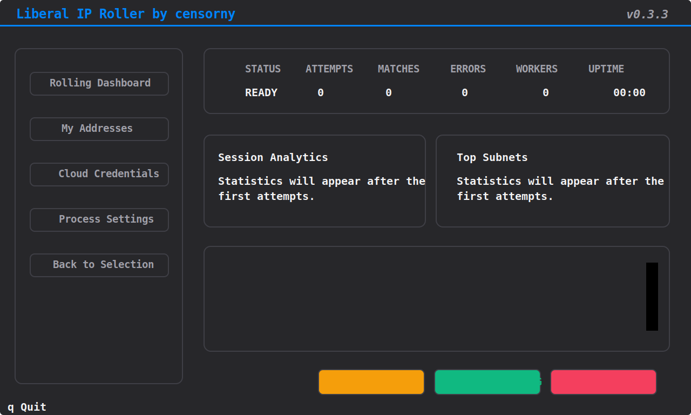

# Liberal IP Roller

<div align="center">

[](README.md)
[](https://www.python.org/downloads/)
[](https://github.com/Textualize/textual)
[](https://github.com/censorny/liberal-ip-roller/stargazers)
[](LICENSE)

</div>

Liberal IP Roller is a terminal-first cloud IP rotation tool for operators who need to match specific IP addresses or CIDR ranges. The project combines a Textual TUI, a headless CLI mode, safe shutdown, session analytics, and persistent local configuration.

> [!WARNING]
> The app can create and delete billable cloud resources. Review quotas, pricing, IAM/API permissions, and cleanup semantics before you run it against a real account.

## Screenshots



## What the project offers

- Textual dashboard for control, logs, analytics, and manual address management.
- Headless mode for automation, remote execution, and dry-run validation.
- Graceful stop and cleanup flow.
- Session analytics including attempts, matches, errors, top subnets, and rate.
- Local configuration persisted in `config.json`.
- Telegram notifications for matches and optionally for errors.
- Automatic launcher scripts for Windows and POSIX environments.

## Provider maturity

| Provider | Status | Strategy | Auth | Notes |
| --- | --- | --- | --- | --- |
| Yandex Cloud | Recommended | Re-create external VPC IPs | IAM token or service-account key | Most battle-tested integration |
| Reg.ru CloudVPS | Supported | VM lifecycle rotation | API token | May need account-specific tuning |
| Selectel Floating IP | Supported | Floating IP rotation on prepared VMs | Keystone service user | Requires prepared VMs in `ru-2` and/or `ru-3` |

> [!IMPORTANT]
> Yandex Cloud is currently the most proven integration. Reg.ru and Selectel are supported, but they may still expose account-, region-, or quota-specific rough edges. If you use anything other than Yandex, feedback with sanitized logs is highly appreciated.

## Quick start

### Option 1. Automatic launch scripts

These scripts create `.venv` if needed, install dependencies from `requirements.txt`, and launch the app:

| Platform | TUI | Headless CLI |
| --- | --- | --- |
| Windows | `run.bat` | `run_cli.bat` |
| Linux / macOS | `run.sh` | `run_cli.sh` |

Examples:

```powershell
run.bat
run_cli.bat --dry-run --service yandex
```

```bash
sh run.sh
sh run_cli.sh --dry-run --service selectel --target-count 1
```

### Option 2. Manual setup

```bash
git clone https://github.com/censorny/liberal-ip-roller.git
cd liberal-ip-roller
python -m venv .venv
```

Windows:

```powershell
.venv\Scripts\activate
pip install -r requirements.txt
python main.py
```

Linux / macOS:

```bash
source .venv/bin/activate
pip install -r requirements.txt
python main.py
```

## Headless mode

Use `-h` or `--headless` to run without the Textual UI. Use `--help` for CLI help.

```bash
python main.py --help
python main.py -h
python main.py -h --dry-run
python main.py -h --service yandex
python main.py -h --service selectel --dry-run --target-count 1
python main.py -h --config path/to/config.json
```

### CLI options

| Option | Meaning |
| --- | --- |
| `-h`, `--headless` | Run without the Textual UI |
| `--help` | Show CLI help |
| `--service {yandex,regru,selectel}` | Override the active provider for the current run |
| `--dry-run` | Validate the pipeline without cloud API calls |
| `--config PATH` | Use a custom config file |
| `--target-count N` | Stop after `N` matches |

If plain headless mode starts on an underconfigured provider, the app first tries another ready provider. If none is ready but target ranges exist, the session falls back to dry-run so the pipeline remains usable.

## Configuration

The main configuration is stored in `config.json`. If the file does not exist, it is created automatically on first launch.

### Required fields by provider

| Provider | Required fields |
| --- | --- |
| Yandex Cloud | `folder_id` and either `iam_token` or `sa_key_path` |
| Reg.ru CloudVPS | `api_token` |
| Selectel Floating IP | `username`, `password`, `account_id`, `project_name`, and at least one of `server_id_ru2` / `server_id_ru3` |

### Important process settings

- `allowed_ranges` — target IPs or CIDR ranges.
- `target_match_count` — how many matches to collect before stopping.
- `ip_limit` — max simultaneous provider resources.
- `dry_run` — safe no-cloud test mode.
- `polling_delay` — provider polling interval.

## Provider notes

### Yandex Cloud

- Fastest and most predictable flow in the project.
- Best choice for primary production usage.
- Supports both IAM token and service-account key authentication.

### Reg.ru CloudVPS

- Works through VM lifecycle operations, so it is slower than Yandex.
- Sensitive to provider quotas and provisioning timing.
- Real-world feedback is especially useful here.

### Selectel Floating IP

- Uses existing VM server IDs in `ru-2` and/or `ru-3`.
- Rotates floating IPs instead of rebuilding compute instances.
- Matching is based strictly on configured IPs or CIDR ranges.
- The main app does not use local `ping`, `curl`, or device-side probing.

## Operational notes

- `config.json` is intentionally ignored by `.gitignore`.
- Logs are written to `app_rolling.log`.
- `update_bootstrap.py` handles the detached update flow.
- Bundled Selectel target ranges live in `resources/selectel/whitelist.txt`.

## Feedback and issue reporting

The repository includes issue templates for both generic bugs and provider-specific feedback:

- `.github/ISSUE_TEMPLATE/bug_report.md`
- `.github/ISSUE_TEMPLATE/provider_feedback.md`

Please include provider, region, exact command, sanitized config fragments, and the relevant part of `app_rolling.log` or headless output.

## Star history

<div align="center">

[](https://github.com/censorny/liberal-ip-roller/stargazers)

[](https://star-history.com/#censorny/liberal-ip-roller&Date)

</div>

## License

Released under the MIT License. See `LICENSE`.