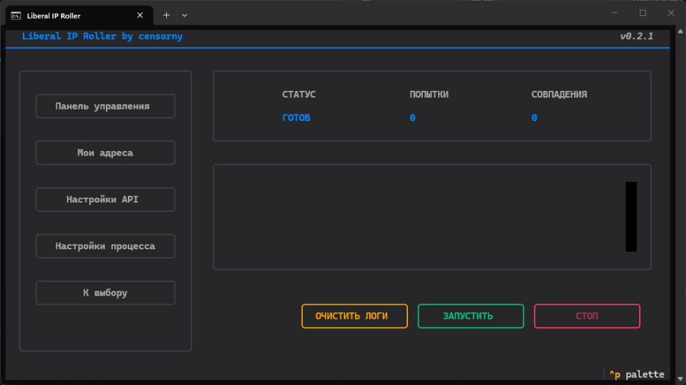

<div align="center">

# 🛡️ Liberal IP Roller
### Industrial-grade Multi-Cloud IP Rotation Engine



[](#)
[](https://opensource.org/licenses/MIT)
[](https://www.python.org/downloads/)
[](https://github.com/Textualize/textual)
[](https://github.com/censorny/liberal-ip-roller)

**Автоматизируйте поиск специфических IP-адресов с хирургической точностью и промышленной надежностью.**  
*Automate the search for specific IP ranges with surgical precision and industrial stability.*

---

### [🇷🇺 Читать на Русском](#russian) &nbsp; | &nbsp; [🇬🇧 Read in English](#english)

</div>

---

<a name="russian"></a>
## 🇷🇺 Русская Версия

> [!CAUTION]
> **⚠️ ВНИМАНИЕ / ATTENTION**  
> Проект предназначен для автоматизации облачных ресурсов. Перед запуском **ТЩАТЕЛЬНО** изучите настройки в `config.json` и лимиты ваших облачных провайдеров. Ротация ресурсов может быть платной в зависимости от вашего тарифа. Автор не несет ответственности за списания средств, превышение квот или блокировки аккаунтов. Изучайте документацию облаков перед стартом!

### 🎯 Возможности (Industrial Features)
**Liberal IP Roller** — это профессиональный инструмент для тех, кому нужны чистые IP-адреса в специфических подсетях (CIDR).
- 🎩 **Industrial TUI**: Полноценный терминальный интерфейс (на базе Textual) с поддержкой мыши, горячих клавиш и адаптивной разметкой.
- 🛡️ **Graceful Shutdown**: Безопасная остановка процесса. Нажатие `Ctrl+C` корректно завершает облачные операции, не оставляя «мусора» в вашем аккаунте.
- 📄 **Ротация Логов**: Все операции пишутся в `app_rolling.log` с автоматической ротацией. Ваш диск никогда не переполнится.
- 📱 **Telegram Notifications**: Мгновенные уведомления о найденных совпадениях.
- 🌍 **Мультиязычность**: Встроенная поддержка русского и английского языков с автоматическим выбором при первом запуске.

---

### ☁️ Провайдеры

| Возможность | 🟡 Yandex Cloud | 🔵 Reg.ru |
| :--- | :--- | :--- |
| **Механика ротации** | Пересоздание статических IP в VPC | Пересоздание VM (Instance) |
| **Авторизация** | SA Key (JSON) / IAM Token | API Token |
| **Скорость поиска** | ⚡ Очень быстро (пара секунд) | 🕒 Умеренно (зависит от деплоя VM) |
| **Лучшее применение** | Непрерывная ротация сотен IP. | Поиск специфических региональных пулов. |

---

### 📖 Гайд по быстрому старту

#### Шаг 1: Подготовка
Убедитесь, что у вас установлен Python версии >= **3.10**. 
```bash
git clone https://github.com/censorny/liberal-ip-roller/
cd liberal-ip-roller
pip install -r requirements.txt
```

#### Шаг 2: Настройка `config.json`
Откройте `config.json` и настройте доступ:
* **Yandex Cloud**: Укажите `folder_id` и путь к JSON-ключу сервисного аккаунта (`sa_key_path`).
* **Reg.ru**: Вставьте ваш API-токен в поле `api_token`.
* **Цели (Allowed Ranges)**: Укажите CIDR подсети, которые вы ищете (например, `51.250.0.0/16`).

#### Шаг 3: Запуск
```bash
python main.py
# или используйте run.bat (Windows) / run.sh (Linux/Mac)
```

---

<a name="english"></a>
## 🇬🇧 English Version

> [!CAUTION]
> **⚠️ ATTENTION / ВНИМАНИЕ**  
> This project automates cloud resources. Before running, **CAREFULLY** study the settings in your `config.json` and the limits of your cloud providers. Rolling resources might cost money. The author is not responsible for any costs incurred.

### 🎯 Key Highlights
**Liberal IP Roller** is a high-performance automation engine designed for acquiring specific IP addresses within target CIDR ranges.
- 🎩 **State-of-the-art TUI**: Built with Textual for a modern terminal experience including mouse support and sleek animations.
- 🛡️ **Zero-Dangling Policy**: Advanced cleanup logic ensures that no cloud resources are left orphaned even after sudden crashes or manual stops.
- 📄 **Industrial Logging**: Persistent file logging with automatic rotation and rich TUI logs.
- 📱 **Smart Alerts**: Telegram integration for real-time match reporting.
- 🌍 **Native Localization**: Full Russian and English support out of the box.

---

### ☁️ Supported Clouds

| Feature | 🟡 Yandex Cloud | 🔵 Reg.ru |
| :--- | :--- | :--- |
| **Rotation Logic** | Sequential VPC IP Re-creation | Full Instance (VM) Cycling |
| **Authorization** | SA Key Auth / IAM Support | API Token |
| **Search Latency** | ⚡ Ultra fast (sub-second) | 🕒 Moderate (cloud-provisioning bound) |
| **Primary Use Case** | High velocity IP hunting. | Geo-specific pool discovery. |

---

### 📖 Quick Setup Guide

#### 1. Installation
Requires Python **3.10+**.
```bash
git clone https://github.com/censorny/liberal-ip-roller/
cd liberal-ip-roller
pip install -r requirements.txt
```

#### 2. Configuration
Edit `config.json`:
* **Yandex**: Set `folder_id` and `sa_key_path`.
* **Reg.ru**: Set your `api_token`.
* **Targeting**: Add your desired networks to `allowed_ranges` (e.g. `84.201.128.0/18`).

#### 3. Execution
```bash
python main.py
```

---

### 💖 Support The Project
If this tool saved you time or infrastructure costs, consider supporting the developer:

| Asset | Network | Wallet Address |
| :--- | :--- | :--- |
| **USDT** | **TON** | `UQAStmfLsz9c3yRA3SeADT5kKdKSUZIt0i6z6B0A6gT884wE` |
| **USDT** | **TRC20** | `THCFoTpjGdaEkGvQe9V8A3WMdQMJ3fUhTq` |
| **USDT** | **BEP20** | `0xc6e0828F6aAF152E82fbEb9f7Abd39051208502F` |

---

## 📈 Star History
[](https://star-history.com/#censorny/liberal-ip-roller&Date)

---

## 📄 License
Released under the **MIT License**. Created with passion by **censorny**.

- **Telegram**: [@censorny](https://t.me/censorny)
- **Discord**: `censorny`

<div align="center">
  <sub>Built with ❤️ for the community.</sub>
</div>
