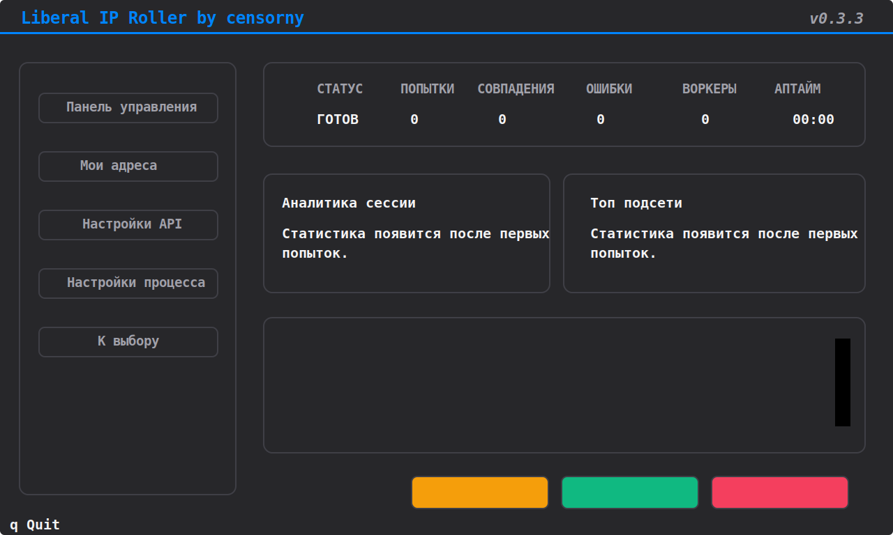

# Liberal IP Roller

<div align="center">

[](README.en.md)
[](https://www.python.org/downloads/)
[](https://github.com/Textualize/textual)
[](https://github.com/censorny/liberal-ip-roller/stargazers)
[](LICENSE)

</div>

Liberal IP Roller — терминальный инструмент для ротации облачных IP-адресов по целевым IP и CIDR-диапазонам. Проект ориентирован на практическую эксплуатацию: TUI на Textual, headless-режим для автоматизации, аккуратная остановка, аналитика по сессии и конфигурация, которая создаётся автоматически при первом запуске.

> [!WARNING]
> Приложение может создавать и удалять платные облачные ресурсы. Перед реальным запуском проверьте квоты, стоимость, IAM/API-права, лимиты по IP и правила очистки у вашего провайдера.

## Скриншоты



## Что умеет проект

- Полноценный TUI-интерфейс для запуска, логов, аналитики и управления адресами.
- Headless-режим для серверов, автоматизации и безопасных dry-run проверок.
- Корректная остановка ротации с очисткой облачных ресурсов.
- Сессионная аналитика: попытки, совпадения, ошибки, top subnets, частота попыток.
- Локальное сохранение конфигурации в `config.json`.
- Telegram-уведомления о совпадениях и, при желании, об ошибках.
- Автоматические launcher-скрипты для Windows и POSIX.

## Статус провайдеров

| Провайдер | Статус | Механика | Авторизация | Комментарий |
| --- | --- | --- | --- | --- |
| Yandex Cloud | Рекомендуется | Пересоздание внешних VPC IP | IAM token или service-account key | Самый стабильный и обкатанный путь |
| Reg.ru CloudVPS | Поддерживается | Цикл создания и удаления VM | API token | Может требовать подстройки под конкретный аккаунт и квоты |
| Selectel Floating IP | Поддерживается | Ротация floating IP на заранее подготовленных VM | Keystone service user | Требуются подготовленные VM в `ru-2` и/или `ru-3` |

> [!IMPORTANT]
> На текущий момент Yandex Cloud — самая зрелая интеграция в проекте. Reg.ru и Selectel поддерживаются, но могут вести себя хуже на отдельных аккаунтах, регионах или лимитах. Если вы используете не Yandex, пожалуйста, присылайте фидбек с обезличенными логами и коротким сценарием воспроизведения.

## Быстрый старт

### Вариант 1. Автоматический запуск через скрипты

Эти скрипты сами создают `.venv` при необходимости, ставят зависимости из `requirements.txt` и запускают приложение:

| Платформа | TUI | Headless CLI |
| --- | --- | --- |
| Windows | `run.bat` | `run_cli.bat` |
| Linux / macOS | `run.sh` | `run_cli.sh` |

Примеры:

```powershell
run.bat
run_cli.bat --dry-run --service yandex
```

```bash
sh run.sh
sh run_cli.sh --dry-run --service selectel --target-count 1
```

### Вариант 2. Ручная установка

```bash
git clone https://github.com/censorny/liberal-ip-roller.git
cd liberal-ip-roller
python -m venv .venv
```

Windows:

```powershell
.venv\Scripts\activate
pip install -r requirements.txt
python main.py
```

Linux / macOS:

```bash
source .venv/bin/activate
pip install -r requirements.txt
python main.py
```

## Headless-режим

Для headless-режима используется `-h` или `--headless`. Для справки используется обычный `--help`.

```bash
python main.py --help
python main.py -h
python main.py -h --dry-run
python main.py -h --service yandex
python main.py -h --service selectel --dry-run --target-count 1
python main.py -h --config path/to/config.json
```

### Параметры CLI

| Параметр | Назначение |
| --- | --- |
| `-h`, `--headless` | Запуск без Textual UI |
| `--help` | Показать CLI help |
| `--service {yandex,regru,selectel}` | Переопределить активного провайдера на текущий запуск |
| `--dry-run` | Проверить пайплайн без облачных API-вызовов |
| `--config PATH` | Использовать альтернативный config-файл |
| `--target-count N` | Остановиться после `N` совпадений |

Если headless запущен на неполностью настроенном провайдере, приложение сначала пытается переключиться на другой валидный провайдер. Если такого нет, но целевые диапазоны заданы, сессия автоматически переключается в dry-run, чтобы пайплайн оставался пригодным для проверки.

## Конфигурация

Основной конфиг хранится в `config.json`. Если файл отсутствует, он будет создан автоматически с дефолтами.

### Обязательные поля по провайдерам

| Провайдер | Что обязательно заполнить |
| --- | --- |
| Yandex Cloud | `folder_id` и одно из: `iam_token` или `sa_key_path` |
| Reg.ru CloudVPS | `api_token` |
| Selectel Floating IP | `username`, `password`, `account_id`, `project_name` и хотя бы один из `server_id_ru2` / `server_id_ru3` |

### Ключевые process-настройки

- `allowed_ranges` — целевые IP или CIDR.
- `target_match_count` — сколько совпадений нужно найти до остановки.
- `ip_limit` — сколько ресурсов можно держать активными одновременно.
- `dry_run` — безопасная симуляция без реальных API-вызовов.
- `polling_delay` — интервал опроса провайдера.

### Минимальный пример

```json
{
  "active_service": "yandex",
  "yandex": {
    "api": {
      "iam_token": "",
      "folder_id": "your-folder-id",
      "sa_key_path": "C:/path/to/sa-key.json",
      "zone_id": "ru-central1-a",
      "ip_limit": 2,
      "target_match_count": 1
    },
    "process": {
      "allowed_ranges": [
        "51.250.0.0/17",
        "84.201.128.0/18"
      ],
      "dry_run": false,
      "polling_delay": 0.0
    }
  }
}
```

## Важные замечания по провайдерам

### Yandex Cloud

- Самый быстрый и предсказуемый сценарий в проекте.
- Лучше всего подходит для основной эксплуатации.
- Поддерживает и IAM token, и service-account key.

### Reg.ru CloudVPS

- Работает через lifecycle VM, поэтому медленнее Yandex.
- Чувствителен к квотам и таймингам на стороне провайдера.
- Если используете в проде, фидбек особенно полезен.

### Selectel Floating IP

- Использует заранее существующие VM в `ru-2` и/или `ru-3`.
- Ротирует floating IP, а не полноценно пересоздаёт compute-instance.
- Совпадения проверяются только по IP/CIDR-списку.
- Локальные `ping`, `curl` или device-side проверки в основном приложении не используются.

## Что стоит знать перед публикацией и эксплуатацией

- `config.json` специально находится в `.gitignore` и не должен коммититься.
- Логи пишутся в `app_rolling.log`.
- Скрипт `update_bootstrap.py` отвечает за безопасный detached update flow.
- Бандл целевых диапазонов Selectel лежит в `resources/selectel/whitelist.txt`.

## Сообщения об ошибках и фидбек

Если вы хотите сообщить о баге или провайдерной проблеме, в репозитории уже добавлены шаблоны issue:

- `.github/ISSUE_TEMPLATE/bug_report.md`
- `.github/ISSUE_TEMPLATE/provider_feedback.md`

Полезно приложить:

- провайдера и регион;
- обезличенный фрагмент `config.json`;
- точную команду запуска;
- релевантный кусок `app_rolling.log` или headless-вывода.

## Статистика по звёздам

<div align="center">

[](https://github.com/censorny/liberal-ip-roller/stargazers)

[](https://star-history.com/#censorny/liberal-ip-roller&Date)

</div>

## Лицензия

Проект распространяется по MIT License. Подробности — в `LICENSE`.
